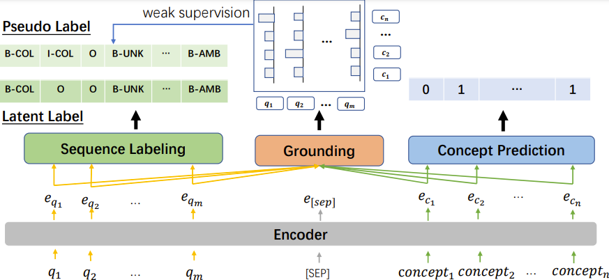

## 📖 Introduction
This is the official repository for the paper ["Know What I don't Know: Handling Ambiguous and Unknown Questions for Text-to-SQL"](https://aclanthology.org/2023.findings-acl.352/). 

In this paper, we propose a simple yet effective counterfactual example generation approach that automatically produces ambiguous and unanswerable text-to-SQL examples. Furthermore, we propose a weakly supervised **DTE** (**D**etecting-**T**hen-**E**xplaining) model for error detection, localization, and explanation. 

**DTE** aims to detect unanswerable and ambiguous spans in user question and give explainations to end-users by probing grounding knowledge from pretrained language models.




## ⚡️ Environment
config your local environment.
```bash
conda create -n dte python=3.7
conda activate dte
conda install pytorch==1.7.1    cudatoolkit=10.1 -c pytorch
pip install -r requirements.txt
```

set your own wandb key, get it from https://wandb.ai/home:
```bash
export WANDB_API_KEY=your_own_key_abcd
```

## 🔧 Data Preparation
We put the data in `data` folder. You can download the data from [here](https://drive.google.com/file/d/1iucIjvQ7K1X5hxHdtmWhOWORmAVhUVEV/view?usp=sharing). Unzip the `data.zip` and put the subfolders in `data` folder.


## 🔨 Model Training
Training scripts: `run.sh`.
Before your training, please figure out every command and arguments, and change user-related, path-related and gpu-device-related arguments to your own environment.
The training time is about 3 hours in 4 x 16G V100.

Usage:
```bash
chmod +x run.sh
./run.sh exp_name
```


# 💬 Citation

If you find our work is helpful, please cite as:
```
@inproceedings{wang-etal-2023-know,
    title = "Know What {I} don{'}t Know: Handling Ambiguous and Unknown Questions for Text-to-{SQL}",
    author = "Wang, Bing and Gao, Yan and Li, Zhoujun  and Lou, Jian-Guang",
    booktitle = "Findings of ACL 2023",
    address = "Toronto, Canada",
    publisher = "Association for Computational Linguistics",
    url = "https://aclanthology.org/2023.findings-acl.352",
    doi = "10.18653/v1/2023.findings-acl.352",
    pages = "5701--5714"
}
```

# 👍 Contributing

We welcome contributions and suggestions!